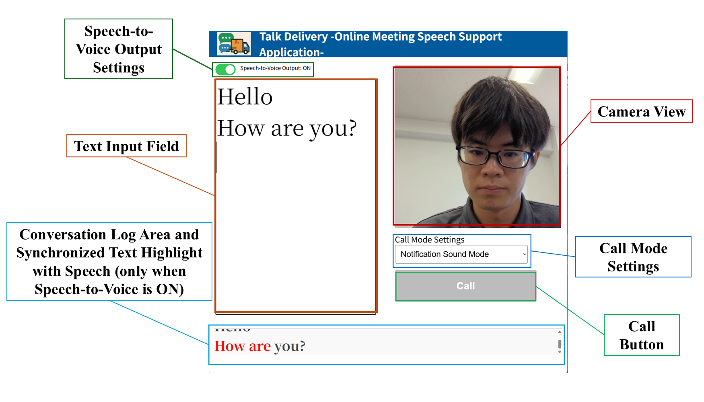

# Talk Delivery – A Speech Support App for Online Meetings –

---

# 1. System Overview

## ① Text Input Field

Enter the content you want to say.  
When you press the Enter key, the text will be confirmed and read aloud as speech.

If you want to speak, type your message in this input field.

Pressing Enter twice will automatically delete the text inside the speech input area.

---

## ② Camera View

This is the camera screen used to display the user's face.

Note:
If the Talk Delivery window is placed behind the Zoom window, the camera screen may not appear.

---

## ③ Call Mode Settings

You can choose between two call modes:

- Notification Sound Mode
- “Is Now a Good Time?” Mode

The calling method differs depending on the selected mode.

Notification Sound Mode:
A knocking sound (“knock knock”) is sent.

“Is Now a Good Time?” Mode:
The text “Is now a good time?” is sent.

---

## ④ Call Button

Press this button to call the other participant using a notification sound or voice message.

Use this when you want to indicate that you would like to speak.

---

## ⑤ Speech(Conversation) Log Area

Your entered messages are saved as logs.

You can use this area to review your past statements.

---

## ⑥ Speech-to-Voice Output Settings

You can toggle On/Off whether the entered text is read aloud.

(Default setting: Off)

---

## ⑦ Text Highlight Synchronized with Speech

(When speech playback is On)

As the speech is read aloud, the corresponding text in the Speech Log Area is highlighted in red sequentially.

---

## ⑧ Automatic Layout Adjustment

The display size of each function automatically adjusts according to the browser window size.

Even when the screen size is reduced, the application can be used alongside other applications such as Zoom.

---

# 2. How to Use

## Step 1. Setting Up Talk Delivery

1. Click “Code → Download ZIP” at the top right of the GitHub page to download the Talk Delivery files.
2. Extract the downloaded ZIP file.
3. Open `index.html` in the extracted folder by double-clicking it. Talk Delivery will launch in your browser.

---

## Step 2. Installing OBS Studio (if not installed)

1. Visit the OBS official website:
https://obsproject.com

2. Download the installer for your OS (Windows / macOS).

3. Run the installer and follow the instructions to complete installation.

4. Launch OBS after installation.

---

## Step 3. Setting Up a Virtual Camera in OBS (for Zoom Integration)

1. Launch OBS.

2. Click the “+” button in the Sources panel at the bottom and select Window Capture.

3. Enter any name (e.g., TalkExpress) and click OK.

4. Double-click Window Capture and select the Talk Delivery window in the Window field.

5. Click OK after selecting it.

6. Adjust the screen size as needed.

7. From the top menu, select Tools → Start Virtual Camera.

---

## Step 4. Using OBS Video in Zoom

1. Launch Zoom and open Settings → Video.

2. Select OBS Virtual Camera from the Camera list.

3. If the Talk Delivery screen appears in Zoom, the setup is successful.

Additional Notes

- Talk Delivery can be used overlapping with Zoom windows.  
If the camera screen does not appear, adjust the window stacking order (front/back).

- For audio input, make sure the correct microphone is selected in Zoom.

- The VB-CABLE virtual audio device is highly recommended.  
https://vb-audio.com/Cable/

Using this allows only the computer's internal audio to be sent to Zoom, enabling speech without capturing surrounding noise.

VB-CABLE Setup

1. In your system sound settings, change the output device (speaker) to:

CABLE Input (VB-Audio Virtual Cable)

2. In Zoom Settings → Audio, configure:

Microphone:
CABLE Input (VB-Audio Virtual Cable)

Speaker:
CABLE Input (VB-Audio Virtual Cable)

3. In Zoom settings, adjust the noise suppression level:

Settings → Audio → Audio Profile  
→ Zoom Background Noise Suppression  
→ Low (faint background noise)

This prevents notification sounds from being suppressed.

---

# 3. Recommended Environment

OS:
Windows (Mac is also supported)

Browser:
Google Chrome  
Microsoft Edge

Firefox may not properly support the automatic layout adjustment feature.